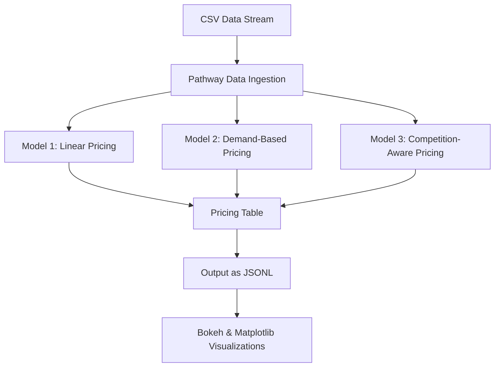

## Project Overview: Dynamic Pricing for Urban Parking

Urban parking is a limited and highly dynamic resource in modern cities. Fixed pricing models often fail to adapt to fluctuations in demand, leading to congestion, underutilization, or user dissatisfaction. This project tackles that problem using real-time data-driven pricing strategies.

**Our goal:**  
To build a robust dynamic pricing system for urban parking lots that:

- Responds to **real-time occupancy**, **demand**, **traffic conditions**, and **special events**
- Suggests **rerouting** when nearby lots are cheaper or less congested
- Simulates real-world parking behavior using a **streaming data approach**

The system is powered by **Pathway**, a real-time data processing framework, and includes **three smart pricing models**:

1. **Model 1 – Linear Pricing:** Based on simple occupancy levels  
2. **Model 2 – Demand-Based:** Adjusts for traffic, queue length, vehicle type, and holidays  
3. **Model 3 – Competition-Aware:** Incorporates prices at nearby lots and reroutes users

This project demonstrates how modern data infrastructure can optimize urban systems for better efficiency, fairness, and revenue.

## Tech Stack Used

| Layer              | Tools / Libraries                              | Purpose                                        |
|--------------------|------------------------------------------------|------------------------------------------------|
| **Data Streaming** | `Pathway`                                      | Real-time data ingestion & processing          |
| **Programming**    | `Python 3.11`                                  | Core programming language                      |
| **Data Handling**  | `pandas`, `numpy`                              | Data manipulation and transformation           |
| **Visualization**  | `matplotlib`, `bokeh`, `seaborn` (optional)    | Plotting price trends and model comparisons    |
| **Modeling**       | Custom Python functions (3 pricing models)     | Smart dynamic pricing logic                    |
| **Notebook**       | `Jupyter`, `Google Colab`, `VS Code`           | Interactive development and testing            |
| **Version Control**| `Git`, `GitHub`                                | Code management and project hosting            |
| **Documentation**  | `Markdown`, `Mermaid.js`                       | Project README and architecture diagrams       |

## Project Architecture

## Project Architecture & Workflow

This project is structured to simulate a real-time parking environment using streaming data and dynamic pricing logic. The architecture is modular and layered, ensuring clean data flow, separation of concerns, and adaptability to real-world deployment.

### Workflow Overview

1. **Data Ingestion (CSV Stream → Pathway):**  
   - A historical dataset (in CSV format) simulates live parking data.
   - Pathway ingests this stream in real time using a filesystem connector.

2. **Schema Validation & Cleaning:**  
   - The input data is validated against a defined schema using `Pathway.Schema`.
   - Fields like occupancy, vehicle type, traffic, and timestamps are parsed and type-checked.

3. **Parallel Pricing Models:**
   - The ingested data is fed into **three parallel pricing models**:
     - **Model 1:** A basic linear model based on occupancy rate
     - **Model 2:** A demand-driven model factoring in queue length, vehicle type, traffic conditions, and special days
     - **Model 3:** A competition-aware model that reroutes users to cheaper lots if high congestion or high pricing is detected

4. **Dynamic Rerouting Logic (Model 3 only):**  
   - Model 3 checks nearby lots for cheaper and less-congested alternatives.
   - If better options are found and the current lot is over 90% full, it flags for rerouting.
   - These reroute events are logged to a CSV for audit and analysis (`reroute_log.csv`).

5. **Output Generation:**
   - Final prices from all three models are combined into a unified `pricing_table`.
   - The table is exported as a streaming `.jsonl` file for real-time downstream consumption.

6. **Visualization & Reporting:**
   - Using `matplotlib`, `bokeh`, and `seaborn`, various pricing behaviors over time are visualized.
   - Charts comparing Model 1 vs Model 2 vs Model 3 help illustrate the impact of smarter pricing.
   - Summary statistics and reroute analytics are captured in a report and visual dashboard.

### Real-World Adaptability

This architecture is designed to easily scale to:
- Real-time parking sensors
- External APIs (traffic, events, weather)
- Live user interfaces (e.g. mobile rerouting recommendations)

